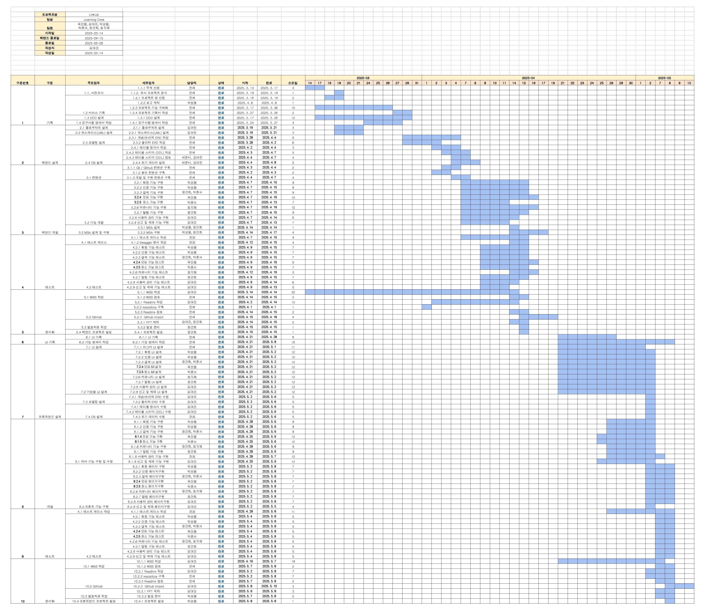
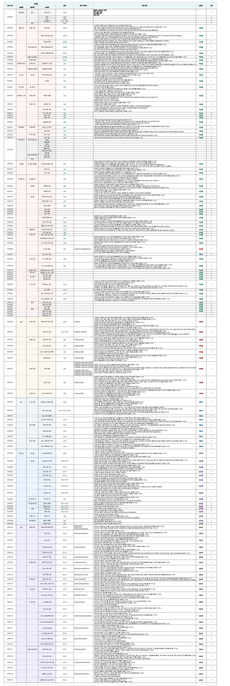

<div align="center">

<br>

🤼‍♂️ LinkUP
<br><br>모임이라는 소속에 구애받지 않고 언제든 원할 때 신청해 <br>여러 사람들과 운동을 즐길 수 있는 플랫폼

</div>

<br>

---


## 📚 목차

1. [🏆 팀 소개](#1--팀-소개)  
2. [📘 프로젝트 기획서](#2--프로젝트-기획서)  
3. [🛠️ 기술 스택](#3--기술-스택)  
4. [📁 파일 구조](#4--파일-구조)  
5. [💻 백엔드 프로젝트](#5--백엔드-프로젝트)
6. [📊 산출물](#6--산출물)  
   - [📊 WBS](#1--wbs-작업-분배-및-일정)  
   - [🧩 기능 정의서](#2--기능-정의서)   
   - [🧪 테스트 케이스 상세](#3--테스트-케이스-상세)  
7. [🫂 팀원 회고](#7--팀원-회고)  

<br>

---

## 1. 🏆 팀 소개

<br>

|                     곽진웅                     |                   김여진                   |                      박성용                      |                   박준서                   |                   장건희                   |                  최지혜                  |
| :-----------------------------------------: | :-------------------------------------: | :-------------------------------------------: | :-------------------------------------: | :-------------------------------------: | :-----------------------------------: |
|  |  |  |  |  |  |
| [mijuckboon](https://github.com/mijuckboon) | [meowdule](https://github.com/meowdule) | [develop-psy](https://github.com/develup-psy) | [Joonspar](https://github.com/Joonspar) | [jang9465](https://github.com/jang9465) | [jihye25](https://github.com/jihye25) |


<br>

---

## 2. 📘 프로젝트 기획서

<details>
<summary>프로젝트 기획서</summary>

<details>
<summary>📌 1. 프로젝트 주제</summary>

<br>

LinkUp은 모임이라는 소속에 구애받지 않고 언제든 원할 때 신청해 여러 사람들과 운동을 즐길 수 있는 플랫폼입니다.

</details>

<br>

<details>
<summary>📌 2. 프로젝트 소개</summary>

<br>

**LinkUp**은 사용자가 자신의 **위치와 시간에 맞춰 운동 모임에 참여하거나 직접 개설할 수 있는 운동 모임 플랫폼**입니다.  
실시간 참여 인원 확인과 장소 예약 기능까지 제공하여, **간편한 모임 개설과 참여, 그리고 자연스러운 참여 유도 시스템**을 통해 운동을 더 쉽고 꾸준히 이어갈 수 있도록 지원합니다.

<br>

</details>

<br>

<details>
<summary>📌 3. 프로젝트 배경 및 필요성</summary>

### 🔎 배경

현대 사회에서 운동은 단순한 건강 관리를 넘어, 사람들과의 교류와 소속감을 느낄 수 있는 중요한 여가 활동으로 자리 잡고 있습니다. 특히 팀 단위 또는 파트너가 필요한 종목들(풋살, 농구, 배드민턴, 탁구 등)의 경우, 함께할 사람을 찾는 일이 운동의 지속성과 몰입도를 결정짓는 주요 요소가 됩니다.

그러나 현재의 운동 참여 방식은 다음과 같은 문제점을 안고 있습니다.

1. **폐쇄적인 동호회 문화**
    - 기존 동호회는 고정 멤버 중심으로 운영되어, 신규 참여자가 심리적 부담을 느끼는 경우가 많습니다.
    - 특히 운동 초보자에게는 높은 실력 수준이나 경쟁적인 분위기가 장벽으로 작용합니다.
2. **비효율적인 시설 예약 방식**
    - 운동 시설 예약은 아직도 전화 또는 오프라인 방식에 의존하는 경우가 많아 불편함이 큽니다.
    - 여러 업체의 정보를 한 곳에서 비교하거나 예약 상태를 실시간으로 확인하기 어렵습니다.
3. **개인 맞춤형 모임 매칭 부재**
    - 기존 서비스는 성별, 연령, 실력 수준 등 사용자의 조건을 고려하지 않은 일률적인 방식으로 매칭이 이루어지고 있습니다.
    - 이는 만족도 낮은 참여로 이어지고, 장기적인 운동 습관 형성에도 부정적인 영향을 줍니다.

더불어 **1인 가구 증가, 유연근무제 도입, 불규칙한 생활 패턴** 등으로 인해

정기적인 모임 참여가 어려운 사용자들이 늘어나고 있으며,

이들은 **즉흥적으로 참여할 수 있는 ‘번개 모임’ 형태의 운동 참여 방식**을 선호하고 있습니다.


### 🧠 필요성

현대인의 라이프스타일 변화와 운동 참여 방식의 다양화는, 기존의 운동 플랫폼으로는 더 이상 사용자들의 수요를 충분히 충족시키기 어렵다는 현실을 보여주고 있습니다. 아래와 같은 사회적 흐름은 본 서비스의 필요성을 뒷받침합니다.

1. **개인화된 라이프스타일과 불규칙한 일상**
    - 1인 가구의 증가, 유연근무제 확산, 비정기적인 스케줄 등으로 인해 고정된 시간에 정기적으로 모임에 참여하기 어려운 사람들이 많아지고 있습니다.
    - 이에 따라 당일 또는 주간 단위의 **즉흥적인 운동 모임에 대한 수요**가 커지고 있습니다.
2. **신뢰 기반 오프라인 커뮤니티의 부재**
    - 온라인에는 다양한 운동 커뮤니티가 존재하지만, 오프라인에서 실질적으로 함께 운동할 수 있는 **신뢰 기반의 모임 공간**은 매우 부족한 실정입니다.
    - 운동을 함께할 사람을 찾는 것 자체가 하나의 장벽이 되어 **운동 지속률 저하**로 이어지고 있습니다.
3. **모임 기반 운동의 효과성**
    - 혼자 하는 운동보다, 함께하는 운동은 꾸준함과 동기 부여 측면에서 훨씬 효과적입니다.
    - 사회적 연결을 통해 **신체 건강과 정서적 안정**을 동시에 도모할 수 있다는 점에서, 모임 중심 플랫폼의 가치는 더욱 커지고 있습니다.
4. **유휴 자원의 활용 필요**
    - 공공 체육시설, 소규모 체육관 등은 특정 시간대에 비효율적으로 운영되는 경우가 많습니다.
    - 본 서비스는 이와 같은 **유휴 공간을 운동 모임과 연결**함으로써, 지역 자원의 효율적 활용을 가능하게 합니다.
5. **건강한 참여 문화를 위한 시스템 필요**
    - 노쇼, 무단 취소, 매너 부족 등 기존 모임 플랫폼에서 발생하는 문제들을 해결하기 위해, 후기 및 평가 시스템을 넘어선 **매너온도 기반 신뢰 시스템**이 요구됩니다.

따라서 본 프로젝트는,

**위치 기반 번개 운동 모임 매칭**, **조건 필터링**, **실시간 인원 확인**, **장소 예약 및 결제 통합**,

그리고 **신뢰 기반 평가 시스템**까지 통합하여,

**현실적인 참여 환경과 지속 가능한 운동 커뮤니티**를 제공합니다.

이는 단순한 운동 플랫폼을 넘어,

**사용자의 라이프스타일에 맞춘 여가 플랫폼이자, 지역 커뮤니티와 체육 자원의 연결 허브**로서의 가능성을 지닙니다.

</details>

<br>

<details>
<summary>📌 4. 타 서비스와의 차별점</summary>

<br>

| 항목 | 본 서비스의 차별화 요소 |
| --- | --- |
| 다양한 운동 종목 | 팀 기반 운동 종목 전반 지원 |
| 모임 개설 구조 | 사용자 주도형 번개 운동 모임 |
| 참여 방식 | 불규칙 일정에도 대응 가능한 즉흥성 |
| 신뢰 시스템 | 매너온도 기반 평가 및 필터링 |
| 결제 구조 | 포인트 기반 자동 정산 및 환불 |
| 장소 예약 | 사업자 연동 예약 시스템 |
| 진입 장벽 해소 | 초보자 환영 구조 및 실력 태그 |

<br>

<br>

본 서비스는 기존 운동 모임 플랫폼과 비교하여 다음과 같은 차별화된 요소를 보유하고 있습니다.

1. **다양한 종목 지원과 즉흥성 강화**
    
    - 기존 플랫폼은 풋살, 배드민턴, 러닝 등 특정 종목에 집중되어 있으나, 본 서비스는 **풋살, 농구, 배드민턴, 테니스, 탁구, 스크린골프, 등산 등 다양한 팀 기반 운동 종목**을 포괄적으로 지원합니다.
    - 특히, '오늘 저녁', '내일 아침'과 같은 **단기성 운동 모임**을 쉽게 생성할 수 있어, **불규칙한 일정을 가진 사용자도 즉흥적으로 참여**할 수 있습니다.
    - 실시간 참여 인원 확인, 매칭 조건 자동 검증, 신청 시 포인트 선결제 구조 등을 통해 **모임 개설부터 참여까지 최소한의 절차로 운동이 성사**됩니다.
2. **사용자 주도형 자율 모임 생성**
    
    - 대부분의 기존 운동 플랫폼은 **관리자 또는 특정 단체 주도의 정기 모임**에 초점이 맞춰져 있으나,
        
        본 서비스는 **일반 사용자가 직접 번개 모임을 개설하고 조건을 설정**할 수 있도록 설계되어 있습니다.
        
    - 성별, 연령대, 실력 수준, 매너온도 등의 조건 필터링을 통해 **자신에게 잘 맞는 참가자를 직접 모집**할 수 있고,
        
        신청 승인 여부도 **주최자가 직접 관리**할 수 있습니다.
        
3. **매너온도 시스템을 통한 신뢰 기반 매칭**
    
    - 후기, 출석률, 노쇼 여부 등을 정량화한 **매너온도 시스템**을 도입하여, 참여자의 신뢰도를 시각적으로 제공합니다.
    - 이를 통해 신뢰성 높은 사용자 중심의 모임 문화를 조성하고 **재참여율을 높이는 선순환 구조**를 구축합니다.
4. **포인트 기반 선결제 및 정산 시스템**
    
    - 기존 플랫폼은 비용 정산이나 결제 처리가 외부 링크 또는 별도 방식으로 이루어지는 경우가 많습니다.
        
        본 서비스는 **모임 생성 시 주최자가 포인트 선결제를 하고**,
        
        참가자가 신청과 함께 **1/N 금액 자동 차감**,
        
        이후 **인원 증가 시 차액 자동 환불** 등의 **통합형 비용 관리 시스템**을 제공합니다.
        
    - 이는 **공정하고 투명한 비용 구조를 제공**함으로써, 사용자의 신뢰와 편의성을 동시에 만족시킵니다.
        
    - 마일리지 적립 기능도 함께 제공되어 사용자 리텐션을 유도합니다.
        
5. **사업자 연동을 통한 장소 및 장비 예약 통합**
    
    - 사업자는 장소 및 장비 정보를 등록하고 예약 가능 시간대를 관리할 수 있으며, 사용자는 플랫폼 내에서 **운동 모임과 장소 대여를 함께 처리**할 수 있습니다.
    - 이를 통해 **시설 이용률을 높이고, 예약 과정을 간소화**할 수 있습니다.

이와 같은 차별 요소들은 단순한 운동 매칭을 넘어서, **사용자 경험 중심의 통합 플랫폼**으로서 본 서비스의 경쟁력을 높여주는 핵심이 됩니다.

</details>

<br>

<details>
<summary>📌 5. 서비스 대상</summary>

<br>

1. **혼자 운동하는 데 어려움을 겪는 직장인**
    - 바쁜 일정과 불규칙한 생활로 인해 정기적인 운동 모임에 참여하기 어려운 직장인에게, 당일 또는 주간 단위로 참여 가능한 유연한 번개 운동 모임을 제공합니다.
2. **운동을 함께할 친구를 찾고 있는 사용자**
    - 동아리나 고정된 운동 모임이 부담스러운 사람들에게 자유롭게 모임을 만들고, 또래와 함께 운동할 수 있는 개방형 플랫폼을 제공합니다.
3. **지역 기반 커뮤니티 활동을 원하는 사용자**
    - 지역 주민과의 교류를 원하는 사람들에게, 운동이라는 공통 관심사를 바탕으로 오프라인 네트워크를 형성할 수 있는 기회를 제공합니다.
4. **즉흥적 운동 참여를 선호하는 활동가 및 운동 매니아**
    - 정해진 루틴이 아닌, 그날그날 운동하고 싶은 사용자에게 실시간으로 매칭 가능한 번개 모임 시스템을 제공합니다.
5. **운동을 처음 시작하는 입문자 및 1인 가구, 이주민**
    - 초보자도 부담 없이 참여할 수 있는 모임과 매너 기반 매칭 시스템을 통해, 운동 입문자와 사회적 연결이 필요한 사용자에게 환영받는 구조를 갖추고 있습니다.

</details>

<br>

<details>
<summary>📌 6. 기대효과</summary>

<br>

1. **사용자 측면 : 운동 참여의 지속성과 접근성 향상**

    - **시간과 장소 제약을 최소화한 유연한 참여 환경**을 제공함으로써,
        
        바쁜 현대인도 꾸준한 운동 습관을 형성할 수 있습니다.
        
    - 초보자도 **매너 기반의 신뢰 시스템과 맞춤형 필터링**을 통해 부담 없이 운동 모임에 참여할 수 있어,
        
        운동 진입 장벽이 낮아지고 **보다 다양한 사용자가 스포츠 활동에 접근**할 수 있게 됩니다.

2. **사회적 측면: 지역 커뮤니티와 연결된 건강한 여가 문화 조성**

    - 운동을 매개로 한 지역 중심의 만남은 **오프라인 커뮤니티 활성화**로 이어지며,
        
        **고립감 해소, 세대 간 교류, 건강한 사회적 연결**을 유도합니다.
        
    - 이는 특히 **1인 가구, 이주민, 사회 초년생** 등에게 실질적인 **사회적 소속감과 심리적 안정**을 제공할 수 있습니다.

3. **플랫폼 측면: 신뢰 기반의 자율 생태계 구축**

    - 매너온도 시스템을 통한 **정량적 신뢰도 평가**는
        
        건강한 사용자 행동을 유도하고, **재참여율과 플랫폼의 질적 수준을 향상**시킵니다.
        
    - 사용자 주도의 모임 개설과 참여 구조는 **플랫폼 운영 부담을 줄이는 동시에 확장성과 자생력을 확보**할 수 있는 기반이 됩니다.

4. **지역경제 측면: 유휴 체육시설의 활용도 제고 및 수익 창출**

    - 플랫폼을 통해 공공 및 민간 체육시설의 **공백 시간대 예약과 활용을 유도**함으로써
        
        **유휴 자원의 효율적 운영과 지역 기반 수익 모델**이 가능해집니다.
        
    - 특히 소규모 체육시설, 레저업체, 개인 사업자 등에게는
        
        **홍보·예약·정산까지 연동된 관리 편의성**을 제공하여
        
        **지역 소상공인의 수익 창출에도 긍정적인 효과**를 기대할 수 있습니다.

</details>

<br>

<details>
<summary>📌 7. 향후 확장 방향</summary>

<br>

1. **개인 운동 콘텐츠 및 클래스 기능 추가**
    - 필라테스, 요가, 헬스 등 **1:1 또는 소규모 개인 운동 중심 콘텐츠**를 도입
    - 강사 또는 트레이너와의 **예약 기반 클래스 연동 시스템** 제공
2. **운동 챌린지 및 랭킹 시스템 도입**
    - 사용자 참여를 유도하는 **걸음 수, 소모 칼로리, 운동 횟수 기반의 챌린지 기능**
    - 지역별/종목별 랭킹 시스템을 통해 **게임화(Gamification) 요소** 강화
3. **전문가 매칭 및 실력 분석 기능**
    - 트레이너 및 운동 지도자와의 **멘토링 연계 서비스**
    - 실력 기반의 데이터 분석(모임 후기, 매너온도, 참여 이력 등)을 통한 **AI 기반 매칭 고도화**
4. **실시간 대기자-모임 자동 연결 시스템**
    - 마감된 모임에 대기한 사용자가 **모임 취소 발생 시 자동으로 참여 확정**
    - 참여율을 높이고, **참여자-공간의 낭비를 줄이는 구조**
5. **날씨 및 위치 기반 추천 알고리즘 고도화**
    - 현재 위치, 기온, 강수량 등을 반영한 **실내/실외 종목 추천 시스템**
    - 특정 지역의 실시간 인기 모임 정보 제공
6. 장소 및 장비 예약 세분화
    - 장소 예약을 넘어 대여 가능한 장비에 대한 예약 시스템 연동
    - 장비의 재고 파악과 대여 가능 상황을 통한 간편한 예약 시스템 제공

</details>

<br>

<details>
<summary>📌 8. 주요 기능</summary>

<br>

### 1) 회원 관리 및 인증  
- 이메일, 소셜 로그인  
- 프로필, 계정 복구, 사업자 인증 등  

### 2) 운동 모임 개설 및 참여  
- 조건 기반 모임 생성 및 승인 관리  
- 실시간 인원 확인  

### 3) 포인트 기반 결제  
- 선결제, 자동 1/N 정산, 환불 처리  
- 포인트 충전 및 마일리지  

### 4) 매너온도 시스템  
- 후기, 노쇼 이력 기반 신뢰 시각화  
- 베스트 플레이어 선정  

### 5) 장소 예약 연동  
- 위치 기반 예약  
- 사업자용 등록 및 외부일정 연동  

### 6) 커뮤니티 및 친구  
- 자유 게시판, 댓글, 좋아요, 신고  
- 친구 추가, 활동 이력 조회  

### 7) 실시간 알림  
- 모임 승인/취소, 친구 알림 등  

### 8) 관리자 기능  
- 회원 제재, 신고 처리, 후기 이의신청  
- 사업자 승인, 공지사항 관리

</details>

</details>

<br>

<br>

---

## 3. 🛠️ 기술 스택

### 💻 Backend
<div>


</div>

### 🎨 Frontend
<div>


</div>

### 📦 DataBase
<div>


</div>

### 🛠️ Tool
<div>
 


</div>

<br>

<br>

## 4. 📁 파일 구조


```
📦 LearningCrew_LinkUp
├── 📁 assets                       # 프로젝트 부속 자료
│   ├── 📁 api-docs                 # API 명세 관련 문서
│   ├── 📁 ddl                      # DDL 스크립트 (테이블 생성 등)
│   │   └── 📄 linkup_ddL.sql
│   ├── 📁 images                   # 이미지 자료 모음
│   │   ├── 📁
│   │   └── 📁 backent
│   └── 📁 test_cases               # 테스트 케이스 카테고리별 정리
│       ├── 📁
│       └── 📁 backent
│
├── 📁 linkup
│   ├── 📁 ...
│
└── 📄 README.md                     # 프로젝트 소개 및 사용법

```


<details>
<summary>📂 linkup </summary>

```
📦 LinkUp
├── 📁 linkup.src
│   ├── 📁 api
│   │   ├── 📄 admin.js
│   │   ├── 📄 axios.js
│   │   ├── 📄 user.js
│   │   ├── 📄 place.js
│   │   ├── 📄 community.js
│   │   └── 📄 meeting.js
│   │   
│   ├── 📁 assets
│   │   ├── 📁 css
│   │   ├── 📁 icons
│   │   └── 📁 images.js
│   │   
│   ├── 📁 components
│   │   ├── 📁 command
│   │   └── 📁 layout
│   │   
│   ├── 📁 composables
│   │   ├── 📄 useLoadingBar.js
│   │   └── 📄 usePaginaition.js
│   ├── 📁 features
│   │   ├── 📁 admin
│   │   ├── 📁 auth
│   │   ├── 📁 community
│   │   ├── 📁 meeting
│   │   ├── 📁 place
│   │   ├── 📁 point
│   │   └── 📁 user
│   │   │    ├── 📁 views
│   │   │    ├── 📄 router.js
│   │   │    └── 📁 components
│   ├── 📁 router
│   │   ├── 📄 index.js
│   ├── 📁 stores
│   │   ├── 📄 auth.js
│   ├── 📁 util
│   │   ├── 📄 toast.js
│   ├── 📁 tokens
│   │   └── 📄 design-tokens.json
│   ├── 📄 App.vue
│   └── 📄 main.js

```


</details>


<br>

<br>


---

## 5. 💻 백엔드 프로젝트

🔗 [LinkUp 백엔드 repository](https://github.com/LearningCrew-LinkUp/be15-2nd-LearningCrew-LinkUp)

<br>

<br>


---

## 6. 📊 산출물


### 1. 📊 WBS (작업 분배 및 일정)


🔗 [WBS 명세서 링크](https://docs.google.com/spreadsheets/d/e/2PACX-1vS5z7lnFVoKhrHU0zT55KpMlmla72tCCbzkwDi_7PyI23dByzC5GMS2v7jT-7YjDzr9LlZDPXG-xev4/pubhtml?gid=403982901&single=true)



<br>


### 2. 🧩 기능 정의서

🔗 [테스트 케이스 정의서 링크](https://docs.google.com/spreadsheets/d/e/2PACX-1vS5z7lnFVoKhrHU0zT55KpMlmla72tCCbzkwDi_7PyI23dByzC5GMS2v7jT-7YjDzr9LlZDPXG-xev4/pubhtml?gid=403982901&single=true)

🔗 [기능 정의서 링크](https://docs.google.com/spreadsheets/d/e/2PACX-1vS5z7lnFVoKhrHU0zT55KpMlmla72tCCbzkwDi_7PyI23dByzC5GMS2v7jT-7YjDzr9LlZDPXG-xev4/pubhtml?gid=403982901&single=true)



<br>

<br>


### 3. 🧪 테스트 케이스 상세

> 프론트엔드 테스트 케이스 상세

<br>

<br>

---

## 7. 🫂 팀원 회고


|**곽진웅**|
|------|

> 단기간동안 배운 프론트엔드 지식으로 프로젝트를 진행하려니 어려움이 많았습니다. 피그마를 이용한 화면 설계, html 및 css 코드 작성, vue 코드 작성에 이르기까지 담당한 부분을 완성해내는 게 쉽지 않았는데, 좋은 팀원들을 만난 덕에 이 정도까지 해낼 수 있었습니다. 아직 갈 길이 멀지만 함께한 팀원들을 본받아, 부족한 팀원을 도울 수 있는 실력을 갖출 수 있도록 열심히 달려보려 합니다. 서비스 사용자를 많이 모으기 위해서는 심미성 있는 디자인을 만드는 것도 중요하지만, 백엔드 코드의 버그뿐만 아니라 잘못된 화면 설계 또한 사용자 경험에 불편을 줄 수 있음을 배웠습니다. 또한, css 스타일 시트의 외부 분리, 컴포넌트 재사용 등 프론트엔드에서도 코드의 유지보수성 향상을 위한 노력을 하고 있음을 알 수 있었습니다. 하나의 서비스에 대한 백엔드와 프론트엔드를 모두 개발해보며 둘 사이의 연계가 중요함을 알 수 있었고, 백엔드 프로젝트만 진행했을 때는 와닿지 않았던 DTO, request, response 객체들의 역할을 보다 잘 이해할 수 있게 되었습니다. 이제 최종 프로젝트 시작일이 3주도 남지 않았는데, 지금까지 배운 내용을 바탕으로 잘 하는 것을 목표로 하여 진행해보려 합니다.

<br>


|**김여진**|
|------|

> 백엔드 프로젝트에 이어 바로 프론트엔드 프로젝트를 진행하면서 체력적으로 부담이 있었던 것도 사실이지만, 역할이 명확히 분담되어 있었기에 맡은 부분에 집중하며 무리 없이 개발을 이어갈 수 있었습니다. 비교적 오랜 시간 학습해왔던 자바와 달리, Vue나 CSS는 구조에 대한 이해가 부족했고 반복적인 구현도 익숙하지 않아 초반에는 다소 어려움을 겪었습니다. 특히 UI를 처음 직접 구현해보는 경험이었기에 손에 익지 않은 부분이 많았고, 이로 인해 수업 내용에 집중하기 어렵고 복습에도 어려움이 따랐던 점이 아쉬움으로 남습니다. 그럼에도 불구하고 프로젝트 구조와 기술에 대한 이해를 높이는 데 집중한 만큼, 실무적인 관점에서 얻어가는 것이 많았다고 느낍니다. Vue의 컴포넌트 기반 구조나 CSS의 스타일링 흐름을 직접 경험하며 실제 서비스를 구성하는 데 필요한 기초적인 감각을 익힐 수 있었던 점은 값진 경험이었습니다. 다만, 프론트엔드 전체 흐름에 대한 폭넓은 이해를 쌓기엔 프로젝트 기간이 짧아, 추후에는 다른 파트에 대한 구조나 로직도 탐구해보는 시간을 가지면 좋겠다고 생각했습니다. 이번 프로젝트에서도 팀원 모두가 각자의 역할을 충실히 수행하기 위해 노력했고, 서로의 어려움에 귀 기울이며 함께 해결해나간 덕분에 프로젝트를 잘 마무리할 수 있었습니다. 부족한 부분은 있었지만 그만큼 성장의 기회를 얻었다는 점에서 의미 있는 시간이었습니다.

<br>

|**박성용**|
|------|

> 이번 프론트엔드 프로젝트를 통해 단순히 화면을 구성하는 것을 넘어, 인증 플로우, 상태 관리, 인터셉터, SSE 연결 등 복잡한 로직을 구조적으로 다루는 경험을 할 수 있었습니다. 특히 API와의 통신 과정에서 발생하는 인증 만료, 오류 처리, 페이지네이션과 같은 실제 서비스 환경에서 꼭 필요한 기능들을 직접 설계하고 구현하면서, 사용자 경험을 최우선으로 고려하는 개발자의 시야를 넓힐 수 있었습니다. 또한 컴포넌트를 설계할 때 재사용성과 유지보수를 염두에 두고 코드를 작성하는 습관이 자리 잡혔고, Vue 3 Composition API와 Pinia를 활용하여 상태 관리를 깔끔하게 정리하는 방법을 익혔습니다. 무엇보다 문제 상황을 빠르게 인지하고 근본적인 원인을 파악해 수정하는 과정을 반복하면서, 프론트엔드 개발자로서의 실력을 한층 성장시킬 수 있었던 소중한 시간이었습니다.

<br>


|**박준서**|
|------|

> 프론트엔드 경험이 많지 않아 처음에는 낯설고 어려운 부분이 많았지만, 카카오 지도 API, 주소 기반 위치 변환 API, 위도·경도를 활용한 거리 계산 등 새로운 기술을 하나씩 익혀가며 기능을 구현해 나갈 수 있었습니다. 중간에 예상치 못한 오류나 레이아웃 충돌로 어려움을 겪기도 했지만, 함께 문제를 공유하고 해결책을 찾아준 팀원들의 조언과 도움이 큰 힘이 되었습니다. 이번 작업을 통해 기술적인 성장도 있었지만, 무엇보다도 협업의 과정에서 많은 걸 배우고 감사함을 느낄 수 있었던 소중한 경험이었습니다. 이 배움을 갖고 최종 프로젝트에서는 더욱 성장하겠습니다.

<br>


|**장건희**|
|------|

> 이번 프로젝트에서는 Notification 도메인을 맡아 전체 흐름을 설계하고 구현하는 데 집중했다. CQRS 구조를 기반으로 알림 저장, 이메일 발송(Gmail API), SSE를 활용한 실시간 전송까지 직접 구현하면서 백엔드 구조에 대한 이해가 훨씬 깊어졌고, 도메인별 알림 전송 로직과 수신 설정 등 유연한 설계도 고민할 수 있었다. 프론트(Vue 3)와의 연동 과정에서는 직접 API를 연결하고, 사용자 이벤트에 따라 토스트 알림이 작동하도록 구성하면서 프론트 흐름도 익힐 수 있었다. 기술적으로도 사람들과의 협업 측면에서도 많이 배운, 정말 밀도 있는 시간이었다.

<br>


|**최지혜**|
|------|

> 백이랑 프런트랑 연결하는 게 특히 어려웠으며 오류도 많이 발생해 헤매기도 많이 헤맸습니다. 그래도 강의 때 배운 내용으로 직접 해볼 수 있는 기회를 가질 수 있어 좋았습니다. 직접 해보면서 많이 배울 수 있어 좋은 경험이었습니다.열정 가득한 팀원들 만나 어렵고 체력적으로 힘들어도 힘내어 즐겁게 프로젝트 해낼 수 있었습니다.프로젝트 중 익숙하지 않고 모르는 부분이 많아 질문도 많이 했는데 바쁜 와중에 다들 잘 알려주셔서 감사했습니다.

<br>

---
